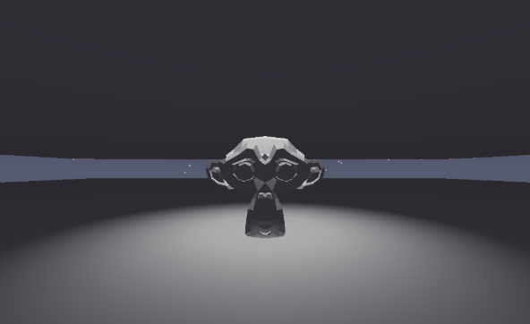

# Flux
Flux is a versatile, high-performance game engine for 3D (and soon 2D).

---

## Planned

- 2D support
- More graphics APIs (Vulkan, DirectX, and etc.)
- More platforms (Linux and MacOS)
- More features (physics, audio, animation, and etc.)

## Current status

The engine is currently in early development and is not yet ready for production use. However, the core architecture is in place, and the following features are currently implemented (will change a lot):
- 3D rendering (OpenGL 4.1+)
- Viewport camera movement
- Basic scene management w/ saving system and settings for projects
- Model transformation (translation, rotation, and scaling)
- "Decent" lighting
- Early physics implementation
- Lua scripting

## Getting started
Flux gonna be cross platform on release (Except for macOS which is still in development)
    
| Windows (.zip)                                          | Linux (AppImage)                                                                                                              | Linux (.deb)                                                        |
| :------------------------------------------------------ | :---------------------------------------------------------------------------------------------------------------------------- | :------------------------------------------------------------------ |
| 1. Download the `.zip` from [Releases](../../releases). | 1. Download the `.AppImage` from [Releases](../../releases).                                                                  | 1. Download the `.deb` from [Releases](../../releases).             |
| 2. Extract the folder to wherever you want it.          | 2. Right-click the file -> Properties -> **Allow executing as program**. (or use `chmod +x Flux_Engine.AppImage` in terminal) | 2. Open your terminal in the download folder.                       |
| 3. Run `Flux.exe` to start the engine.                  | 3. Double-click to run (or use `./Flux_Engine.AppImage` in terminal).                                                         | 3. Run `sudo dpkg -i FluxEngine-1.0.0.deb`.                         |
|                                                         | **Note:** If it fails to launch, install `fuse2` or `fuse3` (e.g., `sudo pacman -S fuse2` on Arch).                           | 4. Run `sudo apt install -f` to fix dependencies, then type `Flux`. |

## Sneakpeeks

*The first screenshot of the engine showing the 3D grid and viewport.*

*A screenshot for the lighting in Flux (as of May 2. 2026)*

## Top Contributors

Small party, I know ;-; (literally just me)

- [@Idkthisguy](https://github.com/Idkthisguy) - Creator and lead developer

## Dependencies
Flux was built with a lot of libraries. and without these libraries, I would've just gave up by now.

Thanks to these libraries that got me this far:

- [Dear ImGui](https://github.com/ocornut/imgui) - For the editor UI
- [SDL3](https://www.glfw.org/) - One of the main backends
- [GLAD](https://glad.dav1d.de/) - OpenGL Multi-Language Loader
- [GLM](https://glm.g-truc.net/0.9.9/index.html) - For the math that I ABSOLUTELY suck at
- [Assimp](https://www.assimp.org/) - Open Asset Import Library (3D Models)
- [stb_image](https://github.com/nothings/stb) - Single-file image loading
- [ImGuizmo](https://github.com/cedricguillemet/imguizmo) - Manipulate objects directly in the viewport
- [LinuxDeploy](https://github.com/linuxdeploy/linuxdeploy) - Used to make and distribute AppImages for Linux
- [ImGuiColorTextEdit](https://github.com/BalazsJako/ImGuiColorTextEdit) - Credits to BalazsJako for making this, ImGuiColorTextEdit is now the foundation of the text editor and has solved one of the big problems making this project.
- [LuaJIT](https://luajit.org/) - For running the Lua scripts
- [sol2](https://github.com/ThePhd/sol2) - For making the API and wraps for Lua
- [nlohmann-json](https://github.com/nlohmann/json) - For JSON handling and persistent saving
- [Jolt Physics](https://github.com/jrouwe/joltphysics) - For physics and collisions

## Credits
### [Favicon (for icons)](https://www.flaticon.com/)
- [Point Light (Freepik)](https://www.flaticon.com/free-icon/idea_566410?term=lightbulb&page=1&position=4&origin=search&related_id=566410)
- [Spotlight (Freepik)](https://www.flaticon.com/free-icon/spotlight_4014388?term=spotlight&page=1&position=7&origin=search&related_id=4014388)
- [Direction Light (Freepik)](https://www.flaticon.com/free-icon/sun_66275?term=sun&page=1&position=1&origin=search&related_id=66275)
- [Camera (Good Ware)](https://www.flaticon.com/free-icon/video-camera_686458?term=camera&page=1&position=15&origin=search&related_id=686458)
### [Blender (For models)](https://www.blender.org/)